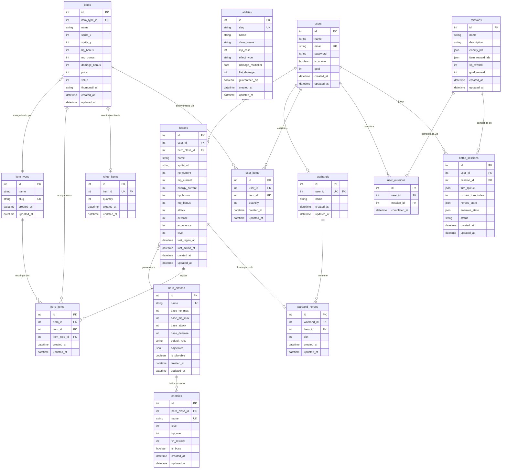

# Diagrama Entidad-Relación — Web Heroes

---

## Resumen de relaciones clave

| Tabla pivote / asociación | Entidades que une | Restricción |
|---|---|---|
| `heroes` | `users` ↔ `hero_classes` | Un héroe pertenece a un único usuario y una clase |
| `hero_items` | `heroes` ↔ `items` ↔ `item_types` | UNIQUE(hero_id, item_type_id) — un héroe solo puede equipar un ítem por slot |
| `user_items` | `users` ↔ `items` | UNIQUE(user_id, item_id) — inventario del usuario |
| `shop_items` | `items` (tienda global) | UNIQUE(item_id) — cada ítem aparece una sola vez en la tienda |
| `warbands` | `users` | 1-to-1 — cada usuario tiene exactamente una warband |
| `warband_heroes` | `warbands` ↔ `heroes` | UNIQUE(warband_id, slot) y UNIQUE(warband_id, hero_id) |
| `user_missions` | `users` ↔ `missions` | UNIQUE(user_id, mission_id) — registro de misiones completadas |
| `battle_sessions` | `users` ↔ `missions` | Estado serializado en JSON (turn_queue, heroes_state, enemies_state) |
| `enemies` | `hero_classes` | Los enemigos reusan la plantilla de clase para stats base |

## Notas de diseño

- **`missions`**: Las referencias a enemigos y recompensas de ítems se guardan como JSON (`enemy_ids`, `item_reward_ids`) en lugar de tablas pivote — facilita la composición flexible de misiones.
- **`battle_sessions`**: El estado de combate completo (cola de turnos, HP actual de cada participante) se serializa como JSON para permitir persistencia y reanudación de batallas.
- **`abilities`**: No tiene FK a `hero_classes`; el campo `class_name` actúa como identificador textual para asociar habilidades a clases.
- **`hero_classes` / `enemies`**: Los enemigos heredan la plantilla visual y de stats de `hero_classes`, permitiendo reusar assets y lógica entre jugadores y enemigos.
